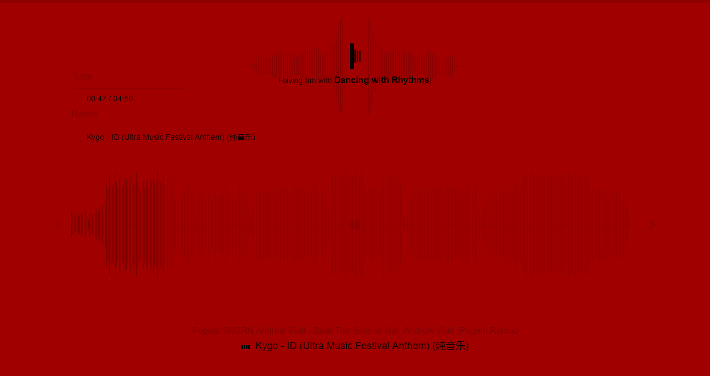
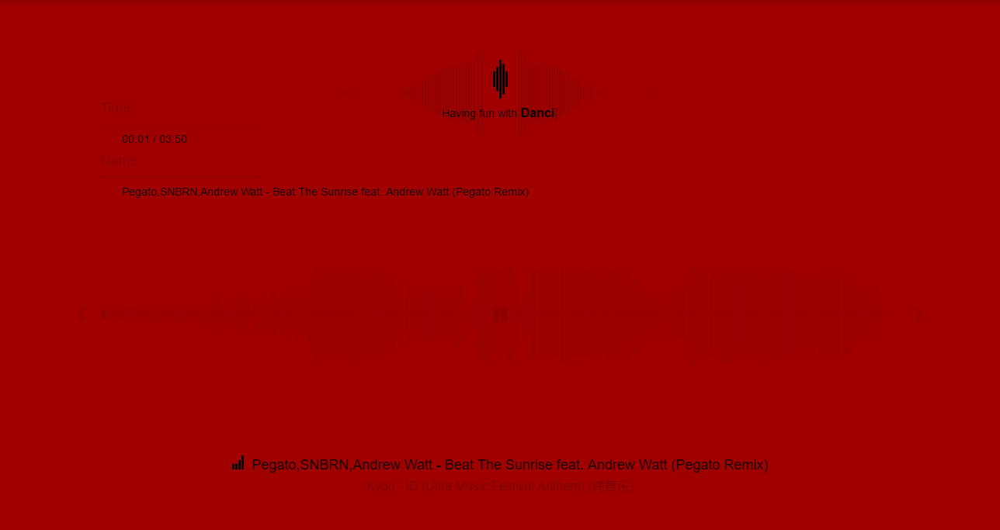

## sound.js

[](#) [](https://github.com/aleen42/sound.js/issues) [](https://raw.githubusercontent.com/aleen42/sound.js/master/LICENSE) [](https://gitter.im/aleen42/sound.js?utm_source=badge&utm_medium=badge&utm_campaign=pr-badge)

A JavaScript project for using Web Audio API to do something awesome. [[**Demo**](http://aleen42.github.io/example/sound/index.html)], this demo has loaded a file with above 8.94 MB, so please wait for its loading.






### Installation

Just clone and build it locally:

```bash
git clone https://github.com/aleen42/sound.js.git
```

Install npm dependencies:

```bash
cd sound.js && npm i --no-save
```

Run the application locally:

```bash
npm run sound
```

The command above will try to load songs of the path: `assets/songs/` via command `npm run task:load`, after which a file named `songList.json` will be created in the assets folder. Then, the command will also create a local server via `npm run task:server`. By default, the application can be accessed by `http://localhost:9000`.

### Usage

If you want to load songs locally, you can just paste files with a `.mp3` format into the folder: `assets/songs/`. After that, remember to run `npm run sound` again to build this project.

*Notice that: this project is temporarily supported MP3 files, and any file without a extension name `.mp3` will not be loaded.*

#### Optional

If you don't want to use `assets/songs`, you can just override the variable `base` array in the file `load.js`, to specify where to scan mp3 files recursively.

```javascript
const base = [
    './assets/songs/',
    /** wrong pointer which will cause resources missing error */
    './../music',
    /** make a soft link like using `ln -s ./../music ./assets/music` */
    './assets/music/'
];
```

*Notice that: because a resource outside a server root is invisible, so if you are using Linux/Mac OS, remember to make a soft link to a path, which is under the root of this project, or this project will have broken down with a relative path like `./../music/`. If you are using Windows OS, I'm very sorry to say that, you have to copy your directory into this project, so that it can be loaded.*

### Referer

- **Oscilloscope visualization** based on <[Visualizations with Web Audio API
](https://developer.mozilla.org/en-US/docs/Web/API/Web_Audio_API/Visualizations_with_Web_Audio_API)>.
- **Wave drawing** based on the document <[Drawing Audio Waveforms](https://aleen42.github.io/PersonalWiki/post/drawing_audio_waveforms/drawing_audio_waveforms.html)>.
- **Beat detection** based on the document  <[Beat Detection Using JavaScript and the Web Audio API](https://aleen42.github.io/PersonalWiki/post/bpm_detection_with_javascript/bpm_detection_with_javascript.html)>.

### :fuelpump: How to contribute

Have an idea? Found a bug? See [how to contribute](https://aleen42.github.io/PersonalWiki/contribution.html).

### :scroll: License

[MIT](https://aleen42.github.io/PersonalWiki/MIT.html) © aleen42
